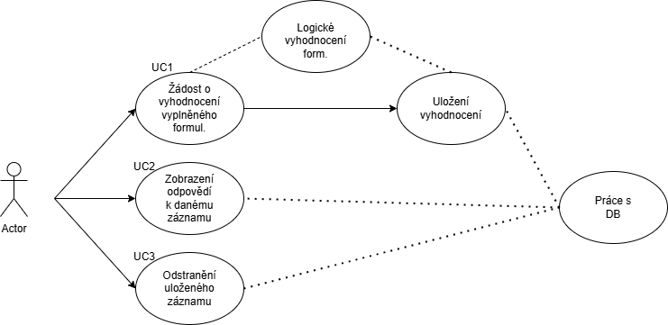
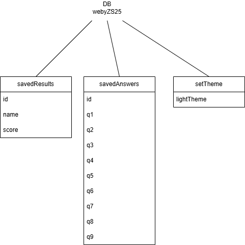
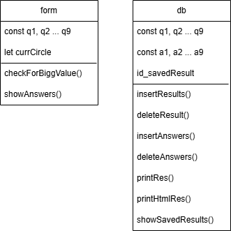

Název aplikace: Do jakého kruhu pekla půjdeš? 

Má závěrečná aplikace se věnuje konceptu pekla, jak jej vylíčil Dante Alighieri v jeho Božské komedii. Principem jest, že existuje 9 úrovní pekla, kdy 9. je nejhorší. Každá úroveň má definováno, za jaký zločin do něj člověk bude patřit. Aplikace funguje na takovém principu, že uživatel vyplní formulář o devíti otázkách, kdy každá otázka má svou hodnotu. Aplikace vyhodnotí "nejzávažnejší" provedený zločin (dle hodnoty otázky) a uživateli řekne, do jakéhu kruhu by potenciálně patřil.

Na stránce je k vidění již zmíněný checkboxový formulář s tlačítkem pro vyhodnocení. Po stisknutí tohoto tlačítka je zobrazen výsledek vyhodnocení, tedy kolikátý kruh pekla je uživateli přiřazen. Také se zobrazí formulář pro zadání jména a uložení výsledku do tabulky. Při zadání jména  akliknutí na tlačítko pro uložení výsledku se stránka znovu načte a uložený výsledek je v tabulce ve spodní části stránky. V tablce je tedy vidět ID záznamu, jménu uživatele, jeho skóre, a navíc je tam tlačítko s názvem "Ukaž" a tlačítko s názvem "Smaž". Uživatel si následně může stisknutím tlačítka Ukaž zobrazit, které checkboxy byly u daného výsledku zaškrtnuty. Výsledky znovu skryje opětovným kliknutím na tsejné tlačítko, jež má v tuto chvíli název "schovej", nebo klikne kamkoliv na stránku - tím se výsledky schovají a formulář je znovu připraven na zaškrtávání. Tlačítkem Smaž uživatel smaže záznam s výsledkem z tabulky na spodu stránky (a tím i z databáze).

Use Cases:

Datový logický model:

V projektu využídám dvě classes, třídu Form, která čte, logicky zpracovává a zobrazuje výsledek formuláře. Druhá, třída DB, pracuje s databází, výsledky i odpovědi vkládá do databáze a na popud uživatele s daty pracuje - zobrazuje odpovědi či maže záznamy.

Class diagram:

